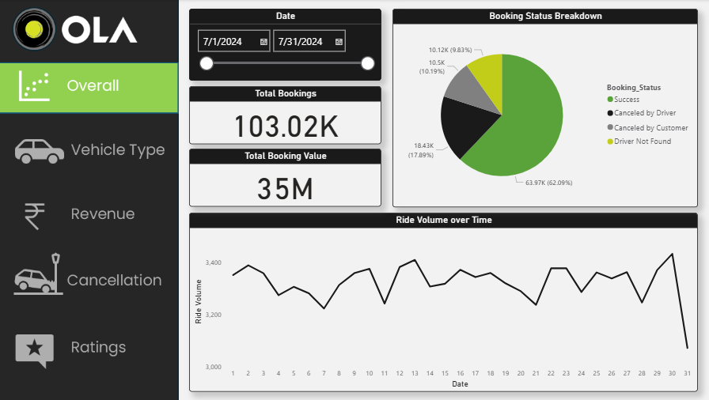
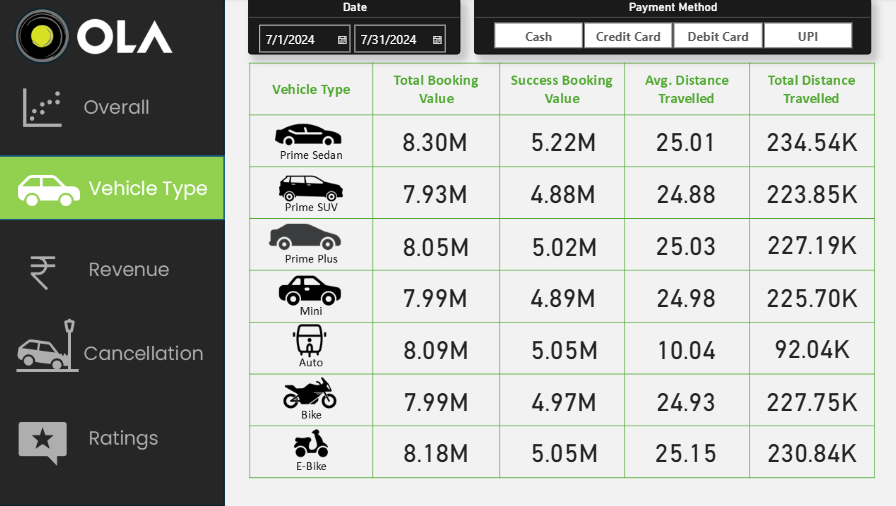
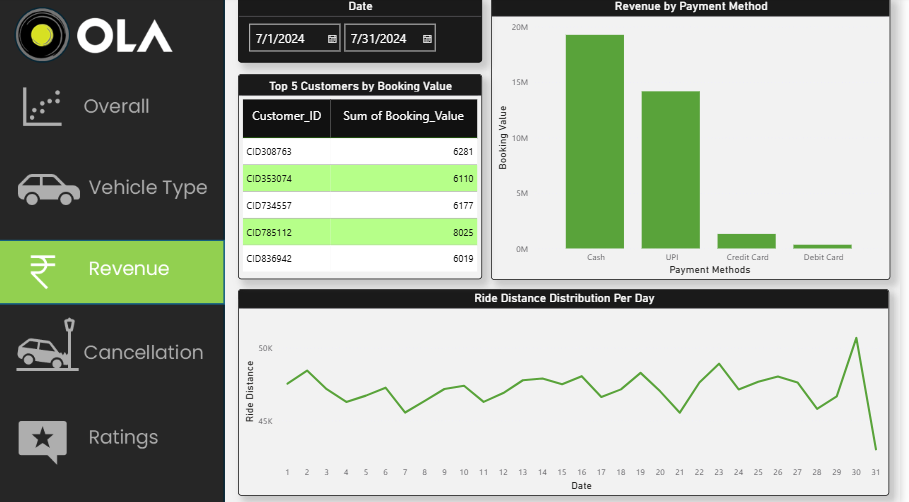
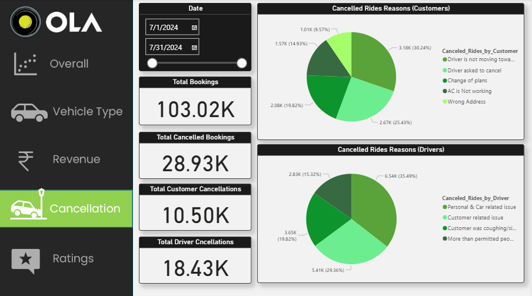
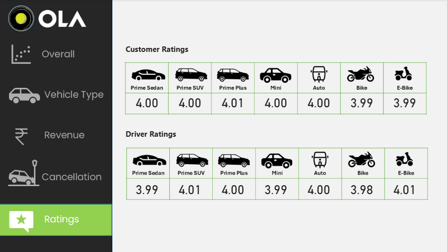

# 🚖 Ola Bookings Data Analysis Project

## 📌 Project Overview  
This project analyzes **100,000+ Ola ride bookings** to uncover insights into **customer behavior, cancellations, revenues, ride patterns, and ratings**.  

It demonstrates an **end-to-end data analysis pipeline**:  
- **Excel** → Data cleaning & validation  
- **Python** → Data ingestion (CSV → MySQL)  
- **SQL** → Data querying, KPI calculation, and views  
- **Power BI** → Dashboard design & visualization  

The project highlights my ability to work with **large datasets** and deliver actionable insights using the key tools of a Data Analyst.

---

## 🛠 Tools & Technologies  
- **SQL (MySQL Workbench)** → querying, aggregations, KPI views  
- **Excel** → cleaning, preprocessing, validation  
- **Python (pandas, mysql.connector)** → ingestion of raw CSV into MySQL  
- **Power BI** → dashboard creation, interactive reports  

---

## 📊 Key Analyses (SQL Queries)  
- Successful vs. Cancelled bookings  
- Average ride distance per vehicle type  
- Top 5 customers by total rides  
- Rides cancelled by drivers (personal & car issues)  
- Driver rating distribution (Prime Sedan focus)  
- Payment method analysis (UPI, Cash, Card, Wallets)  
- Average customer rating per vehicle type  
- Total booking value of successful rides  
- Cancellation rate by vehicle type (driver vs. customer)  
- Revenue contribution by Pickup–Drop pairs  

---

## 📈 Dashboards (Power BI)  
The interactive dashboards provide a **visual summary** of key insights:

- **Overall Summary Dashboard** – total bookings, revenue, cancellations, ratings  
- **Revenue Analysis** – payment method contribution, ride value trends  
- **Customer Cancellations** – breakdown of cancellations by type & frequency  
- **Driver Ratings** – distribution across vehicle types  
- **Vehicle Type Performance** – average distance, ratings, and revenue share  

### 📷 Dashboard Samples  
  
  
  
  
  

---

## 🔎 Key Insights  
- 📉 **Cancellation Rate**: ~28% of rides cancelled, with **customers responsible for ~36% of cancellations**.  
- 🚗 **Vehicle Type Trends**: Prime Sedan and E-Bike bookings show **highest booking values**.  
- 💳 **Payment Methods**: Cash dominates with ~57% share, but UPI and wallets are growing.  
- ⭐ **Customer Experience**: Average customer rating ~4.2 across all vehicle types.  

---

## 🚀 Project Workflow  
1. **Data Cleaning (Excel):** Removed duplicates, fixed inconsistent formats, validated fields.  
2. **Data Ingestion (Python):** Automated CSV → MySQL database.  
3. **Data Analysis (SQL):** Built views & queries for KPIs.  
4. **Visualization (Power BI):** Designed dashboards for decision-making.  

---
## 📂 Repository Structure

```text
Ola-Bookings-Analysis/
├── Power_BI_Dashboard/
│   ├── .gitkeep
│   ├── Cancellations.png
│   ├── Overall.png
│   ├── Ratings.png
│   ├── Revenue.png
│   └── Vehicle_Type.png
├── bookings.csv                  # Raw dataset
├── bookings_sql_import.py        # Python: CSV → MySQL
├── ola_bookings.sql              # SQL queries & views
├── ola_bookings.pbix             # Power BI dashboard
└── README.md                     # Project documentation

---

## 📌 Next Steps / Improvements  
- Add time-series forecasting for demand prediction  
- Create machine learning model for **cancellation prediction**  
- Integrate real-time booking feeds for live dashboard updates  

---

## 👩‍💻 About  
This project was created as part of my data analytics portfolio to demonstrate **end-to-end analysis using SQL, Excel, Python, and Power BI**.  
